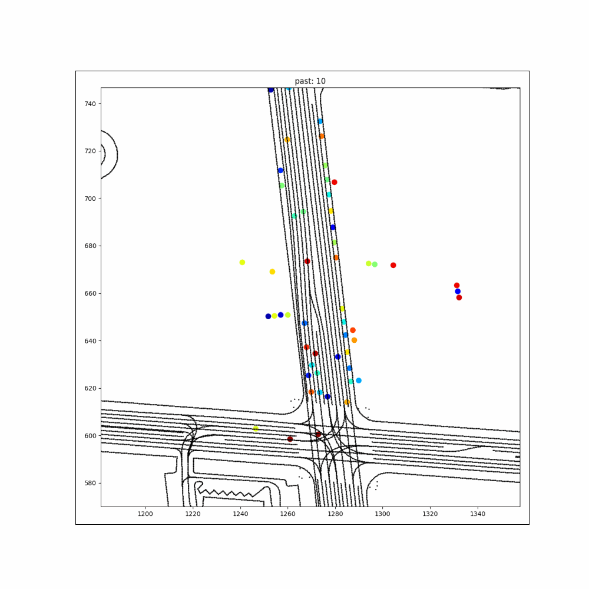
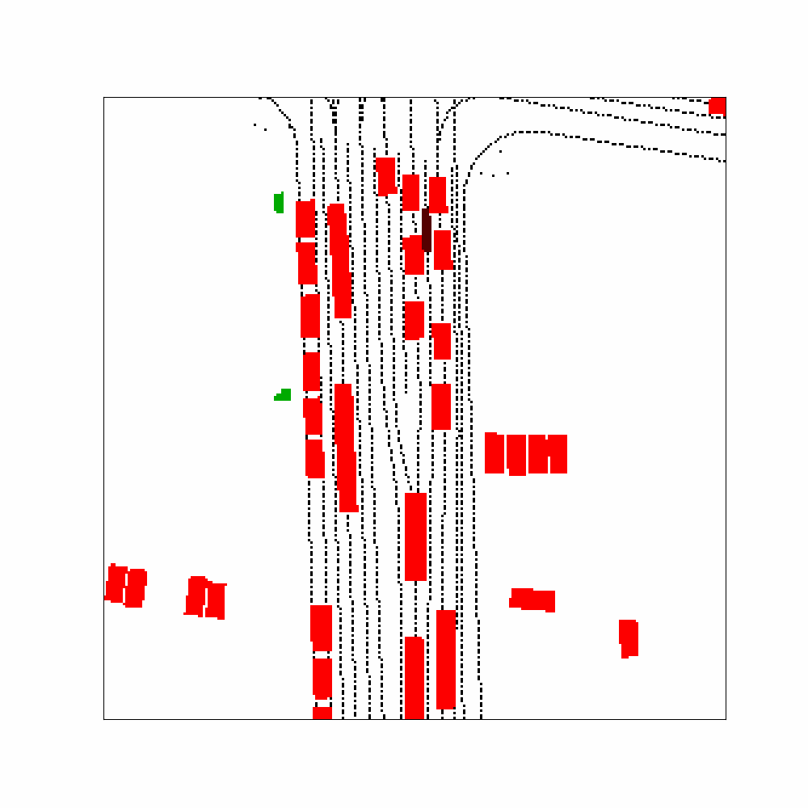
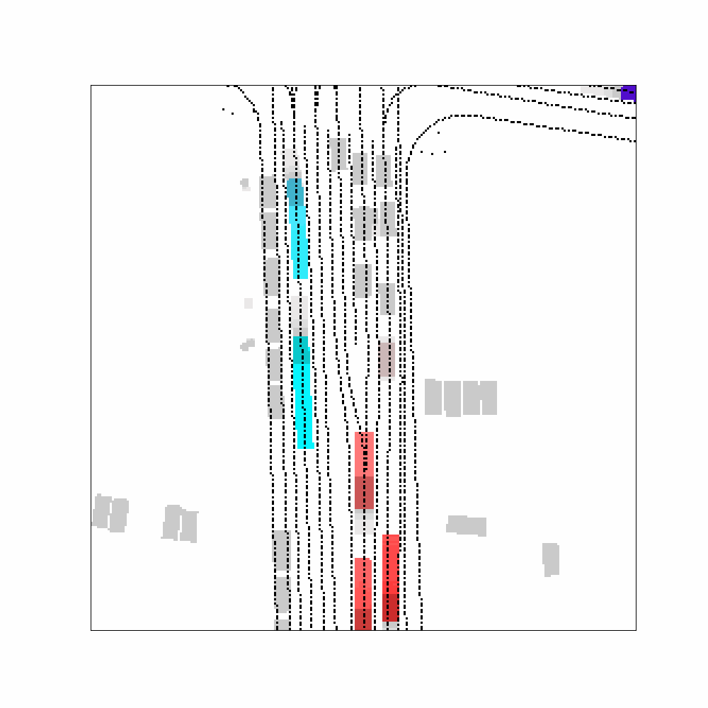

# Occ_Flow_Pred

A baseline solution for Waymo Occupancy and Flow Prediction 

 
 


## Basic Installation

# basic python libraries
```bash
conda create --name occ_flow 
conda activate occ_flow
conda install pytorch torchvision cudatoolkit=11.3 -c pytorch
https://github.com/YoushaaMurhij/Occ_Flow_Pred.git
cd Occ_Flow_Pred
pip install -r requirements.txt

# add Occ_Flow_Pred to PYTHONPATH by adding the following line to ~/.bashrc (change the path accordingly)
export PYTHONPATH="${PYTHONPATH}:/home/josh/workspace/Occ_Flow_Pred/"
```


## TODOs:

[] return filename in tf dataloader to ensure seq-training
[] add pytorch2proto converter for online submission
[] check the loss why to use weights 
