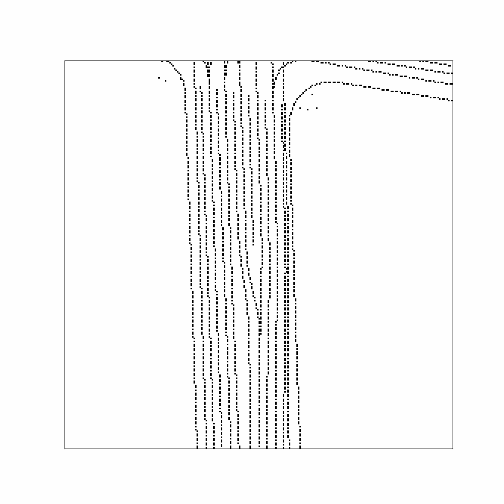

# Occ_Flow_Pred

A baseline solution for Waymo Occupancy and Flow Prediction 

 
 


## Basic Installation

# Docker container:
Using nvidia-docker with cuda-11.3, Pytorch  
```bash
cd path/to/workspace
git clone https://github.com/YoushaaMurhij/Occ_Flow_Pred.git
cd Occ_Flow_Pred/docker
./build.sh
cd ..
./docker/start.sh
./docker/into.sh

```
# Conda environment (not recommended):
```bash
conda create --name occ_flow 
conda activate occ_flow
conda install pytorch torchvision cudatoolkit=11.3 -c pytorch
git clone https://github.com/YoushaaMurhij/Occ_Flow_Pred.git
cd Occ_Flow_Pred
pip install -r requirements.txt

# add Occ_Flow_Pred to PYTHONPATH by adding the following line to ~/.bashrc (change the path accordingly)
export PYTHONPATH="${PYTHONPATH}:/path/to/Occ_Flow_Pred/"
```

## TODOs:
- [ ] add visualizer
- [ ] add eval script
- [ ] replace tqpm 
- [ ] forward time + total 
